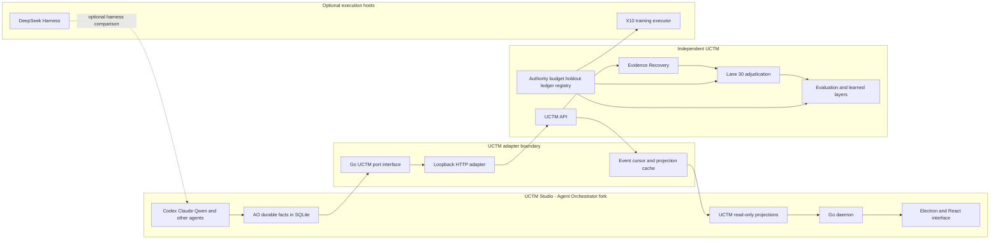

# UCTM Studio: Agent Orchestrator Fork and Interface Absorption Plan

**Plan date:** 27 August 2026  
**Status:** remote fork created; architecture and endpoint plan complete; local clone/build/codemap blocked by capacity  
**Upstream:** `Untrivial-ai/agent-orchestrator`  
**Fork:** `Diomandeee/agent-orchestrator`  
**Integration branch:** `codex/uctm-interface-v0`  
**Pinned Go-rewrite base commit:** `5eb10e3698bdbf0735b84c6aa4d3f06ea8d83ff2`  
**License:** Apache-2.0  
**Proposed product name:** **UCTM Studio**

## 1. Decision

Fork Agent Orchestrator and use its current Go-daemon/Electron application as the primary **operator interface and fleet workspace** for UCTM.

Do not put UCTM authority inside Agent Orchestrator. The fork is a projection, control, and review surface over the independent UCTM spine.

The final ownership model is:

```text
UCTM Studio (AO fork)     operator interface, fleet state, worktrees, review UX
Agent Orchestrator core  sessions, projects, agents, PR/CI, terminals, browser
DeepSeek Harness         optional agent runtime/microkernel experiment
UCTM spine               episodes, splits, gates, learning, evaluation, authority
PACT / pPACT             deterministic consequence validation
Canonical + human        authorization and adjudication
```

The AO fork may display UCTM facts and submit bounded proposals. It may not create canonical labels, unlock holdouts, open training, promote checkpoints, merge evidence into truth, or authorize effects.

## 2. What was forked

The remote fork was created without a local clone because the current filesystem has only 1,845,308 KiB / approximately 1.760 GiB available.

Remote state:

- Fork: `https://github.com/Diomandeee/agent-orchestrator`
- Parent/source: `https://github.com/Untrivial-ai/agent-orchestrator`
- Fork `main`: upstream `main` at `5eb10e3698bdbf0735b84c6aa4d3f06ea8d83ff2`
- Integration branch: `codex/uctm-interface-v0`, based on that exact commit, with documentation-only UCTM planning commits above it
- No local clone
- No dependency installation
- No build or test
- No desktop installation
- No daemon launch
- No database or migration change

Documentation-only commits placed on the fork branch:

- `ce7bd6d3beb8484a001836cb83ea4ae9bc528bb2` — interface absorption plan
- `a73ee9f7f19f019acdcd58375b1fcb0266744390` — fork manifest
- `35134d289c0dfde75d627c85cb51657a66ec9194` — endpoint contract

The integration branch was briefly considered against release `v0.9.2`, then deliberately repinned to current Go-rewrite `main`. The reason is structural, not preference: `v0.9.2` is the legacy TypeScript/pnpm generation, while the desired interface architecture is the current Go daemon plus Electron/React rewrite. Mixing those generations would make the endpoint and package plan false.

## 3. Source and legal assessment

Agent Orchestrator is publicly available under Apache License 2.0. A fork may modify and redistribute the source if it preserves required license and notice material and identifies modifications.

Fork policy:

1. Preserve `LICENSE`, applicable notices, and third-party attributions.
2. Add `FORK_NOTICE.md` naming the upstream project and pinned source commit.
3. Rebrand the product as **UCTM Studio**; do not imply upstream endorsement.
4. Replace AO/Agent Orchestrator product marks only after the source/build qualification gate.
5. Keep the GitHub fork relationship visible.
6. Keep fork `main` as the upstream-tracking branch.
7. Develop only on `codex/uctm-interface-v0` or reviewed successors.
8. Do not rewrite upstream history.

Primary sources:

- [Agent Orchestrator repository](https://github.com/Untrivial-ai/agent-orchestrator)
- [AO architecture](https://github.com/Untrivial-ai/agent-orchestrator/blob/main/docs/architecture.md)
- [Backend code structure](https://github.com/Untrivial-ai/agent-orchestrator/blob/main/docs/backend-code-structure.md)
- [Current status](https://github.com/Untrivial-ai/agent-orchestrator/blob/main/docs/STATUS.md)
- [CLI and daemon routes](https://github.com/Untrivial-ai/agent-orchestrator/blob/main/docs/cli/README.md)
- [Privacy policy](https://aoagents.dev/privacy/)

## 4. Current AO architecture inventory

### Runtime and clients

- Long-running Go daemon.
- Electron + React 19 + Tailwind desktop application.
- Optional Go/Cobra CLI as a thin HTTP client.
- Expo/React Native mobile companion.
- Primary loopback HTTP daemon, default port `3001`.
- REST, SSE change events, terminal WebSocket, and Electron browser bridge.
- Optional authenticated mobile LAN listener.

### Persistence and truth model

- SQLite under `~/.ao/data`.
- Goose migrations and sqlc-generated queries.
- Database-trigger change log.
- CDC poller and SSE broadcast with `Last-Event-ID` replay.
- Durable facts stored; user-facing status derived at read time.
- Failed or unknown probes are observations, not proof of death.
- Dirty registered worktrees are not force-deleted.

### Agent and execution surfaces

- More than twenty terminal agent adapters.
- Structured Chat drivers for Codex, Claude Code, Cursor, OpenCode, Kimi, Pi, Droid, and other supported harnesses.
- TUI via tmux on macOS/Linux and ConPTY on Windows.
- Per-session model and permission configuration.
- Compatible Codex/Claude conversations can switch between TUI and Chat while keeping the AO session and worktree.
- Project orchestrator plus worker sessions.
- Direct delegation and project-aware task title refinement.
- Agent switching and handoff state.

### Workspace and development lifecycle

- One isolated git worktree per Git-backed worker.
- Workspace projects and Scratch sessions.
- Worktree branch ownership and dirty-work preservation.
- PR discovery, checks, reviews, mergeability, comments, merge actions, and review-agent runs.
- CI failure, requested-change, and merge-conflict feedback routed to the owning agent session.
- Session cleanup supports dry-run and preserves ineligible/dirty workspaces.

### User interface

- Project sidebar.
- Worker and orchestrator session views.
- Kanban derived from activity/PR/CI/review facts.
- Structured Chat and native terminal UI.
- Changed files, diffs, terminal tabs, reviewer panes, and shell terminals.
- Session-isolated Electron browser with preview server control.
- Settings, project defaults, agent/model selection, notification history, and mobile connection.

### Current extension reality

AO's current Go backend uses compiled adapters and services. These are not marketplace/npm plugins. Adding UCTM as a first-class interface requires source changes through AO's existing architecture:

```text
domain type
  -> port interface
  -> service
  -> leaf adapter
  -> daemon wiring
  -> HTTP controller/OpenAPI
  -> generated frontend client
  -> React route/components
  -> tests/migration/CDC
```

This is why a fork is justified. A configuration-only appropriation cannot provide the required UCTM domain and interface.

## 5. Why AO is a good UCTM interface

AO already represents most of the operational evidence that UCTM needs to observe:

| AO fact | UCTM interpretation | Authority boundary |
|---|---|---|
| Project | Project/source estate | Not a UCTM dataset release |
| Project orchestrator | Lane `00` coordination provenance | Not UCTM authority |
| Worker session | Source occurrence and candidate family evidence | Not a canonical episode |
| Worktree and branch | Branch/worker lineage | Not an accepted branch label |
| Agent/model/interface | Model and surface provenance | Not evidence of quality |
| Prompt/turn/message | Potential source occurrence | Raw text excluded by default |
| Tool result | Observed artifact/effect evidence | Tool success is not user success |
| Changed file/commit | Artifact provenance | Commit is not acceptance |
| Pull request | Candidate deliverable boundary | PR state is not truth |
| CI result | Verification evidence | Green CI is not deployment readiness |
| Review thread/verdict | Reviewer evidence | Review is not lane-30 adjudication |
| Agent switch/handoff | Cross-surface continuation event | No semantic continuity inferred without IDs |
| Waiting for input | Runtime observation | Not automatically a correction or blocker label |
| Merge | External repository effect | Remains AO/human authority, never UCTM automation |

The key compatibility is philosophical as well as technical: AO stores durable facts and derives display status. UCTM stores provenance-bound evidence and separately adjudicates meaning. The fork should preserve that separation.

## 6. Relationship to DeepSeek Harness

The three systems occupy different layers:

| Layer | System | Role |
|---|---|---|
| Operator interface and fleet workspace | UCTM Studio / AO fork | Projects, sessions, worktrees, PR/CI/review, terminals, browser, status projection |
| Optional execution microkernel | DeepSeek Harness | Plugin/runtime experiment for models, tools, context, and agent execution |
| Learning and evidence plane | UCTM | Episodes, family lineage, splits, context policy, calibration, evaluation |
| Deterministic authority | UCTM spine, PACT, Canonical/human | Gates, holdouts, consequence validation, permission |

Do not nest orchestrators by default. Running AO -> dsh -> Codex/Claude creates duplicate goals, tool policy, lifecycle, context, and session authority. If dsh is later exposed to AO, it must be one explicit harness adapter used only for bounded comparison.

## 7. Target architecture



## 8. Fork package ownership

The UCTM integration should follow AO's current package boundaries.

### Backend additions

```text
backend/internal/domain/uctm.go
backend/internal/ports/uctm.go
backend/internal/service/uctm/
  service.go
  projection.go
  modes.go
backend/internal/adapters/uctm/
  http_client.go
  types.go
  redaction.go
backend/internal/httpd/controllers/uctm.go
backend/internal/daemon/uctm_wiring.go
backend/internal/storage/sqlite/migrations/NNNN_uctm_projection.sql
backend/internal/storage/sqlite/queries/uctm.sql
```

Rules:

- Domain types contain no HTTP, SQLite, UCTM client, or Electron dependency.
- The port is consumed by services and implemented by the leaf adapter.
- Controllers validate and translate only.
- The daemon owns wiring and lifecycle.
- A new migration is appended; no existing migration is edited.
- Projection tables store external UCTM facts and receipt references, not canonical authority.
- CDC publishes projection changes through AO's existing event stream.

### Frontend additions

```text
frontend/src/renderer/routes/_shell.projects.$projectId_.uctm.tsx
frontend/src/renderer/components/uctm/
  UctmOverview.tsx
  UctmLaneBoard.tsx
  UctmGatePanel.tsx
  UctmEvidenceFamilies.tsx
  UctmAdjudicationQueue.tsx
  UctmEvaluationPanel.tsx
  UctmReceiptInspector.tsx
frontend/src/renderer/hooks/useUctm*.ts
```

The API schema and TypeScript client are regenerated through AO's existing `npm run api` path. The new route appears as a project-scoped **UCTM** tab, not as a replacement for AO's Coding or Reviews tabs.

## 9. UCTM Studio information architecture

### Program overview

- Current UCTM truth contract.
- Planned, source-present, implemented, verified, blocked, and accepted states shown separately.
- Active core gate and exact blocker.
- Current code/freeze/release identities.

### Lane board

- `00` Program coordination.
- `10` Capture/provenance/capacity.
- `20A` Evidence Recovery/family envelopes.
- `20B` Interaction topology/BTPO.
- `30` Episode reconstruction/adjudication.
- `40` Split-locked training views.
- `50` Learned adapter and pPACT evaluation.
- `X10`, `X20`, `X30` provider/router/coordination interfaces.

Lane ownership is not encoded into AO's operational Kanban statuses. A worker can be `working` in AO while its UCTM output remains `candidate` or `quarantined`.

### Evidence families

- Source occurrence identity.
- Root/worker/continuation lineage.
- Model/provider/interface provenance.
- Pointer/hash evidence.
- Privacy/use status.
- Recovery disposition.
- Episode-admission status.

### Adjudication queue

Version 0 is read-only. Later versions may present a human decision form, but only after the human-adjudication contract and receipt path are independently qualified.

### Evaluation

- Baseline comparisons.
- Split and holdout identity.
- Context token use.
- Calibration and abstention.
- Invalid proposal and privacy counts.
- Checkpoint lineage.
- pPACT validity comparison.

### Receipts

- Searchable receipt index.
- Source path and hash.
- Witness ceiling.
- Builder/reviewer identity.
- Current-versus-historical distinction.

## 10. Integration modes

The AO fork uses one explicit UCTM mode.

```text
off          no UCTM service, routes return disabled status
read_only    fetch and display UCTM facts only
shadow       read plus pointer/hash source-occurrence proposals and context comparisons
human_gated  explicit local desktop adjudication proposals after separate qualification
```

Configuration:

```text
UCTM_MODE
UCTM_API_BASE_URL
UCTM_API_TOKEN
UCTM_REQUEST_TIMEOUT
UCTM_PROJECT_MAPPING
```

`UCTM_API_BASE_URL` has no active default. Qualification must assign a non-conflicting loopback endpoint and pin it in the integration manifest. DNS names and public binds are rejected in the first release.

## 11. AO-facing API endpoints

### Version 0: read-only interface

```text
GET /api/v1/uctm/status
GET /api/v1/uctm/program
GET /api/v1/uctm/lanes
GET /api/v1/uctm/gates
GET /api/v1/uctm/receipts
GET /api/v1/uctm/families
GET /api/v1/uctm/adjudication/queue
GET /api/v1/uctm/evaluations
```

The existing `GET /api/v1/events` CDC/SSE stream distributes invalidations for UCTM projection-table changes. A second AO SSE system is not added.

### Version 1: shadow proposals

```text
POST /api/v1/uctm/source-occurrences
POST /api/v1/uctm/context-proposals
POST /api/v1/uctm/adjudication-proposals
POST /api/v1/uctm/gate-proposals
```

These endpoints create proposals and receipts only. They cannot mutate UCTM labels, locks, training authority, or AO merge state.

### Version 2: separately qualified human actions

```text
POST /api/v1/uctm/adjudication/{candidateId}/decision
POST /api/v1/uctm/training-requests
```

Version 2 does not open as part of the interface fork. It requires a distinct human-action truth contract, local-desktop-only routing, typed confirmation, idempotency, actor identity, and readback receipt.

## 12. UCTM service endpoints consumed by the fork

```text
GET  /v1/status
GET  /v1/program
GET  /v1/lanes
GET  /v1/gates
GET  /v1/receipts
GET  /v1/families
GET  /v1/adjudication/queue
GET  /v1/evaluations
GET  /v1/events
POST /v1/source-occurrences/ao
POST /v1/context-proposals
POST /v1/adjudication-proposals
POST /v1/gate-proposals
```

Every response includes:

- schema version;
- source commit/freeze identity;
- generated-at time;
- historical/current classification;
- authority ceiling;
- receipt reference;
- content hash or ETag.

## 13. Projection storage

AO stores only interface projections needed for responsive UI and CDC.

Proposed tables:

```text
uctm_projection_records
  project_id
  projection_kind
  external_id
  source_hash
  status
  authority_ceiling
  receipt_ref
  payload_json
  observed_at
  expires_at

uctm_event_cursors
  project_id
  source
  last_event_id
  updated_at
```

Projection constraints:

- AO projection is never the UCTM source of truth.
- Raw prompt/response text is excluded.
- Unknown fields are rejected at the adapter boundary.
- Records are content-addressed and idempotent.
- UCTM service unavailability shows stale/unknown, never an invented healthy state.
- Display status is derived from projection facts and expiry.

## 14. Privacy and network boundaries

The fork is more restrictive than upstream by default.

1. Build with an empty `VITE_AO_POSTHOG_KEY`.
2. Set `AO_TELEMETRY_EVENTS=off` and `AO_TELEMETRY_REMOTE=off` in the UCTM Studio launch environment.
3. Keep all AO state under a fork-specific `AO_DATA_DIR` rather than mixing it with an existing AO installation.
4. Keep the primary AO daemon loopback-only.
5. Do not mount `/api/v1/uctm` on the mobile LAN listener in v0/v1.
6. No raw conversation hydration into UCTM by default.
7. No protected history is copied into `~/.ao` beyond what AO's own agent session requires.
8. UCTM bearer material is environment-only and never returned in DTOs, logs, telemetry, or receipts.
9. Browser and PR merge controls remain AO functions, outside UCTM automation.

## 15. Authority and effect boundaries

UCTM Studio may:

- display UCTM program state;
- display evidence and receipts;
- link AO sessions/worktrees/PRs to UCTM source occurrences;
- submit pointer/hash evidence proposals in shadow mode;
- request advisory context proposals;
- present a human decision interface after qualification.

UCTM Studio may not automatically:

- accept or reject episodes;
- change UCTM labels;
- unlock a holdout;
- open a budget envelope;
- start training;
- promote a checkpoint;
- merge a PR because UCTM recommended it;
- kill or spawn an agent because a learned layer recommended it;
- send external messages or deploy systems;
- treat AO status, PR state, CI, or review as user preference or truth.

## 16. Fork execution gates

### AO-F0 — Remote fork and pin

Status: **complete**.

- Remote fork exists.
- Parent/source verified.
- Upstream and fork main matched at fork time.
- Integration branch is based on exact Go-rewrite commit `5eb10e3` and contains documentation only.
- No local clone/build/install.

### AO-F1 — Capacity and local source qualification

Status: **blocked**.

Prerequisite:

- restore at least the C0 20 GiB floor before cloning/build dependency materialization.

Tasks after capacity passes:

1. Clone only `codex/uctm-interface-v0` into a clean Developer workspace.
2. Record Git object count and allocated size.
3. Verify Apache license and source identity locally.
4. Run the codemap generator and author a UCTM-specific overlay.
5. Install pinned Go/Node/npm dependencies.
6. Run backend build, race tests, root lint, frontend typecheck/test/build, and API-generation parity.
7. Issue `AO_F1_SOURCE_QUALIFICATION_RECEIPT.json`.

### AO-F2 — Read-only UCTM port and adapter

1. Add domain/port/service/adapter/controller/daemon wiring.
2. Add read-only endpoints and OpenAPI contract.
3. Add projection migration/query/CDC.
4. Add fake adapter tests before real UCTM transport.
5. Prove AO works unchanged with `UCTM_MODE=off`.

### AO-F3 — UCTM Studio frontend

1. Add project-scoped UCTM route and navigation.
2. Implement overview, lanes, gates, receipts, families, adjudication queue, and evaluation views.
3. Prove read-only behavior in UI and API tests.
4. Add stale/offline/error states.
5. Add no-telemetry verification.

### AO-F4 — Shadow evidence and context proposals

1. Bind AO session/worktree/PR facts to source-occurrence envelopes.
2. Send pointer/hash records only.
3. Add idempotency and replay tests.
4. Compare AO-native context and UCTM proposals without changing live prompts.
5. Produce divergence receipts.

### AO-F5 — Human adjudication interface

This gate is separate and human-controlled. It requires:

- lane-30 schema and actor contract;
- explicit confirmation flow;
- no mobile write route;
- idempotency key;
- signed/read-back receipt;
- independent security and authority review.

### AO-F6 — Packaging and optional adoption

1. Complete UCTM Studio rebrand and notices.
2. Build signed local artifacts only after source qualification.
3. Run clean-install and rollback tests with fork-specific data directory.
4. Demonstrate upstream sync/rebase procedure.
5. Compare UCTM Studio against unmodified AO and Codex desktop.
6. Issue one verdict: `ADOPT`, `REVISE`, `REJECT`, or `ABSTAIN`.

## 17. Upstream synchronization strategy

- Fork `main` tracks upstream `main` without UCTM commits.
- UCTM work stays on `codex/uctm-interface-v0` and reviewed successors.
- Every upstream sync records old pin, new pin, changed API/migration files, generated-client changes, and test results.
- Never modify an upstream migration; append a new migration.
- Never regenerate OpenAPI/SQL code without checking the generated diff.
- A failing upstream compatibility test leaves the UCTM branch on its prior pin.
- UCTM domain changes should be structured as upstreamable ports/adapters where possible, reducing permanent fork divergence.

## 18. Competition and absorption verdict

### Absorb

- Go daemon and thin-client architecture.
- Durable facts/derived status discipline.
- SQLite/CDC/SSE projection system.
- Project orchestrator plus isolated workers.
- Worktrees and ownership.
- Agent/model/interface adapters.
- PR/CI/review feedback loops.
- Browser/terminal/workspace interface.
- Mobile observation model, subject to UCTM privacy restrictions.

### Preserve outside AO

- UCTM spine.
- Evidence Recovery.
- Episode authority and lane 30.
- Holdout and split locks.
- Learned models and X10.
- PACT/pPACT.
- Canonical and human authorization.

### Do not absorb

- AO operational status as UCTM semantic labels.
- Automatic merge/review effects driven by learned UCTM output.
- PostHog telemetry defaults in the UCTM fork.
- Raw history duplication.
- Legacy TypeScript v0.9.2 architecture as the current fork base.
- Nested AO -> dsh -> Codex orchestration without an explicit experiment.

## 19. Completion endpoints

The AO interface track is concluded when one of these is issued:

- `UCTM_STUDIO_READ_ONLY_QUALIFIED`
- `UCTM_STUDIO_SHADOW_QUALIFIED`
- `UCTM_STUDIO_HUMAN_ADJUDICATION_QUALIFIED`
- `UCTM_STUDIO_REJECTED`
- `UCTM_STUDIO_ABSTAINED`

No interface endpoint implies `UCTM_RESEARCH_V1_COMPLETE`, training readiness, deployment approval, or production authorization.

## 20. Immediate next action

The safe work completed now is AO-F0: remote fork, exact pin, integration branch, architecture inventory, and endpoint plan.

The next executable gate is AO-F1, but it is blocked at approximately 1.760 GiB free. No local clone, codemap, dependency install, build, desktop install, daemon run, database migration, or interface implementation should occur until a fresh capacity receipt clears the 20 GiB floor.
